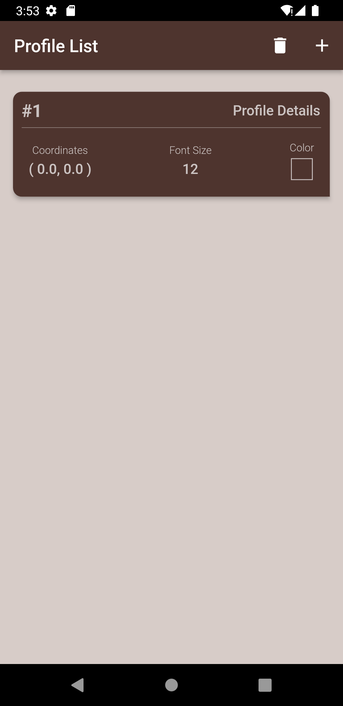

# klimbb148

Klimbb148 is an assignment project for **Foyer** (via **Klimbb**).

## About
It's a simple lightweight location based profile builder app. It's a part of the assignment project for **Foyer** (via **Klimbb**). It encorporates all most all the key concepts that will be used in a real world app. It's a simple app that allows users to create profiles and maintain it.

## Features
- Create profile
- First time launch awareness
- Location based profile
- Coordinate based profile
- Persistent storage

## Packages
- [**Provider**](https://pub.dev/packages/provider) - State management
- [**Shared Preferences**](https://pub.dev/packages/shared_preferences) - First time launch awareness
- [**Isar**](https://pub.dev/packages/isar) - Persistent storage

## Demo
Click here for [**Demo Video**](/assets/demo.mov).
## Screenshots
| Welcome Screen                                                              | Home Screen | Create Profile Screen |
|:----------------------------------------------------------------------------:|:-----------------------------:| :-----------------------------:|
|  |  |  |